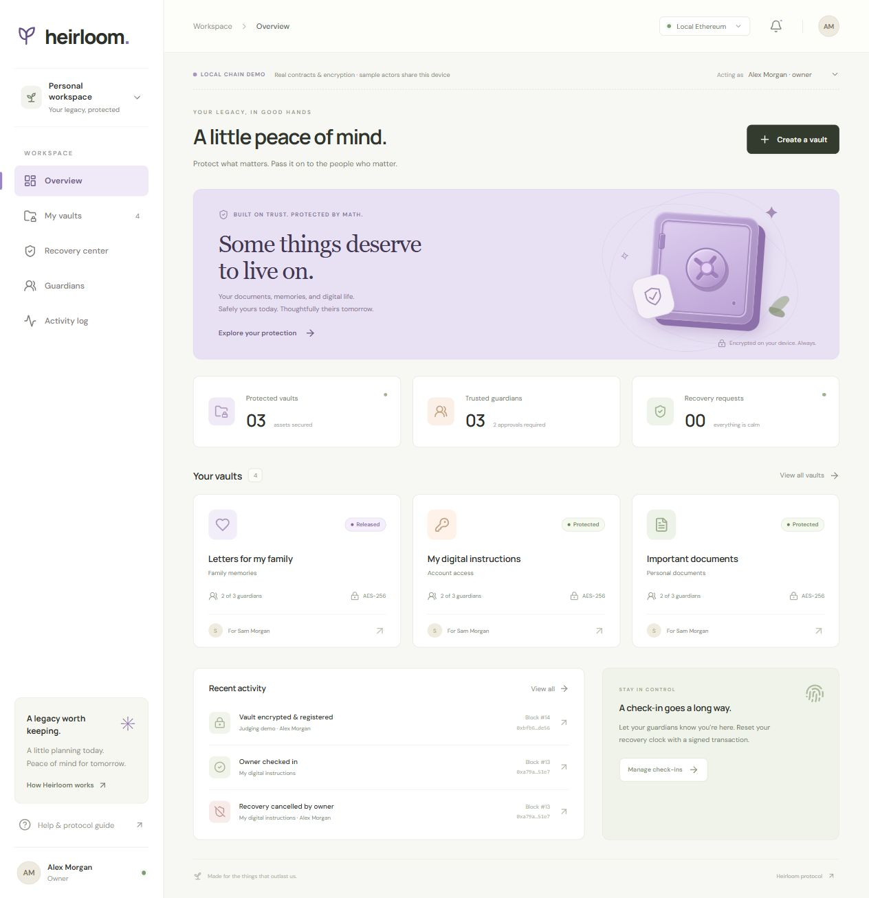
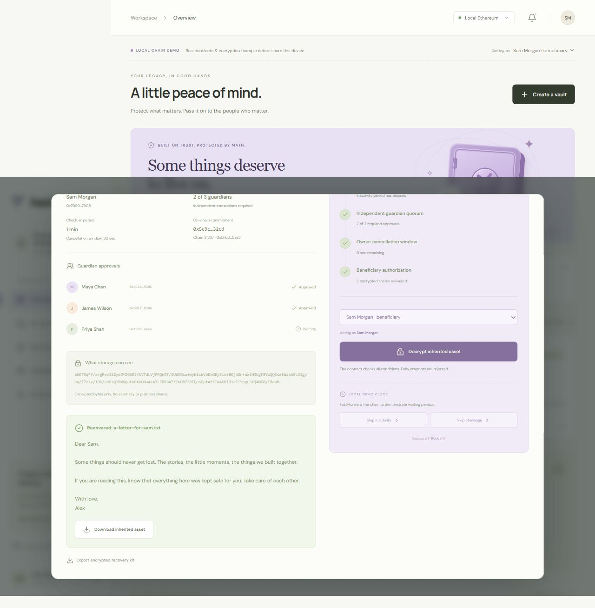
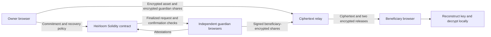

# Heirloom

**Protect what matters. Pass it on to the people who matter.**

Heirloom is a hackathon prototype for digital inheritance. An actual Solidity contract authorizes recovery after a missed owner check-in, two independent guardian attestations, and a full owner cancellation window. The encrypted asset key is split into three shares; two guardians can deliver shares encrypted for the beneficiary, who decrypts locally.

## A look inside

Captured during a local EVM rehearsal. The vault dashboard shows the live demo state; in the second capture, the beneficiary decrypted the exact original letter after two guardians released encrypted shares.





## Run the working demo

Requires Node.js 22 and npm. Hardhat supplies five funded development wallets on a local Ethereum chain. You do not need MetaMask, Sepolia test ETH, or a faucet for this demo. From this directory:

```powershell
npm ci
npm run demo
```

Open [Heirloom](http://127.0.0.1:5173). Keep the terminal running. The command starts Hardhat at port 8545 (chain ID 31337), deploys Heirloom, starts the encrypted relay at port 3001, and serves the UI at port 5173. Choose an actor from the demo switcher; the app signs transactions with that actor's funded Hardhat account. Click **Load sample vaults** to create three encrypted assets with real local Ethereum transactions. Open **Activity log** and select an event to show its receipt, block number, and gas used.

Before presenting, run `npm run demo:check` in a second terminal. It confirms the app and relay are responding, all five demo wallets can sign and have local ETH, and the deployed contract still matches its receipt and bytecode.

The local chain is ephemeral. Stopping its process loses chain state. Browser keys and relay ciphertext persist, but ciphertext alone cannot restore a lost blockchain. A new deployment gets a distinct custody namespace. Do not clear browser site data during the demo. Local transaction hashes are verifiable through the running Hardhat node; they do not have public Etherscan pages.

Read the [three-minute judging walkthrough](docs/DEMO.md) and [public deployment instructions](docs/SEPOLIA.md).

## Public blockchain proof

Open [Deploy Heirloom](http://127.0.0.1:5173/deploy.html) **in the browser containing your Ethereum wallet**. Get Sepolia test ETH, connect, and sign the deployment. The page validates the compiled runtime against the receipt and provides an Etherscan transaction link. Download `heirloom-sepolia.json`, then run:

```powershell
npm run sepolia:import
npm run dev:sepolia
```

The import command defaults to your Windows Downloads folder. For another location, use `npm run sepolia:import -- "C:\full\path\heirloom-sepolia.json"`. It independently checks the RPC network, deployment receipt, block hash, and compiled runtime before accepting the config.

The public app opens at [port 5174](http://127.0.0.1:5174), with a separate relay on port 3002. The local rehearsal stays running at port 5173. No demo accounts or clock fast-forwarding exist in public mode. Public recovery releases require three confirmations. Public deployment is pending until a funded wallet signs it; a local EVM is not a decentralized public network.

## Three Distinct Workspaces & Role-Based Routing

Heirloom provides three tailored, distinct workspaces for the three kinds of people using digital inheritance:

1. **Vault Owner Workspace (`/owner`)**:
   - **Purpose**: Configure asset protection, manage inactivity check-in deadlines, monitor active recovery challenges, and cancel unauthorized claims.
   - **Key Views**:
     - *My Vaults*: Browse encrypted assets, check-in intervals, and guardian quorum policies.
     - *Check-In Manager*: Table of all owned vaults showing inactivity deadlines, challenge status, and one-click check-in.
     - *Activity Log*: On-chain transaction receipts for vault creation, check-ins, and policy updates.
     - *Prominent Recovery Challenge Alert*: When guardians reach quorum to attest incapacity, a prominent banner appears alerting the owner, with an immediate "I'm Here — Cancel Recovery" action to stop the claim within the challenge period.

2. **Beneficiary Workspace (`/beneficiary`)**:
   - **Purpose**: Custody designated vaults, monitor recovery eligibility, initiate claims after owner inactivity, track guardian attestations, and decrypt inherited assets locally.
   - **Key Views**:
     - *Designated Vaults*: Vaults where the connected wallet is the contract-named beneficiary, with contextual status explanations (Protected, Eligible for Recovery, Challenge Window Active, Ready to Finalize, or Ready to Decrypt).
     - *Active Claims*: Detailed progress tracking for claims undergoing guardian attestation and the owner challenge countdown.
     - *Local Decryption*: Local client-side AES-256 reconstruction from verified guardian key shares and instant plaintext download.

3. **Trusted Guardian Workspace (`/guardian`)**:
   - **Purpose**: Independent custodian duty. Review beneficiary recovery claims, attest to owner incapacity after independent verification, and deliver encrypted key shares upon on-chain finalization.
   - **Key Views**:
     - *Attestation Inbox*: Actionable recovery requests requiring attention, displaying owner/beneficiary details, quorum progress, challenge duration, and the legally-critical independent verification notice.
     - *Guarded Vaults*: All vaults where the connected wallet holds an encrypted 1-of-3 key share.
     - *Encrypted Share Release*: Secure delivery of recipient-encrypted Shamir shares directly to the designated beneficiary once recovery has finalized on Ethereum. Private key shares are never rendered in page text or logs.

### Navigation, Access Control & Multi-Role Coherence

- **Role-Based Home Redirection**: After authenticating at `/login` or completing OTP sign-up at `/signup`, users are automatically routed to their persisted role home (`/owner`, `/beneficiary`, or `/guardian`). Accessing generic `/app` routes redirects directly to their role workspace.
- **Session Persistence**: Page reloads preserve the authenticated session and return to the active workspace.
- **Access Denial**: If a user attempts to manually navigate to another role's workspace (e.g. an Owner accessing `/guardian`), a dedicated **Access Restricted** screen explains the required capability, displays their connected wallet, and provides a direct return button.
- **Multi-Role "Assigned to me" Support**: If a user's primary profile role is Vault Owner, but their connected wallet is also named as a beneficiary or guardian on other vaults on-chain, their workspace displays an **"Assigned to me"** section in the sidebar. This ensures on-chain responsibilities are immediately accessible without resorting to fake actor switching.
- **Strict On-Chain Wallet Authorization**: A user's profile role controls UI presentation; the connected Ethereum wallet and smart contract remain the sole authority for blockchain actions. If an account attempts an action on a vault where its wallet is not authorized, the action is disabled and the mismatch is clearly explained.

### Standard User Menu vs. Development Demo

- **Standard User Menu**: Located in the top-right header, displaying full name, email address, role badge, connected wallet address with copy button, and **Sign Out**. The menu contains **no "Switch Profile / Account"** or fake switching controls.
- **Development Demo Drawer**: On local chains (`31337`), an explicitly labelled **DEVELOPMENT DEMO** bottom drawer is available for evaluators to switch between the 5 pre-funded Hardhat accounts (Alex Morgan, Sam Morgan, Maya Chen, James Wilson, Priya Shah) and immediately inspect their respective workspaces. This evaluation drawer is **absent from public testnet and production modes**.

## What is implemented

- Public landing page at `/` with clear human explanation, protocol diagrams, and prominent CTAs.
- Dedicated `/signup` and `/login` pages with real email OTP verification and session token authentication.
- Protected workspace routing (`/app`) with redirect persistence and session restoration.
- File or note encryption with AES-256-GCM; file name, MIME type, and contents are encrypted. Maximum file size: 5 MB.
- Two-of-three Shamir sharing using Privy's existing library. RSA-OAEP identities wrap fresh AES share-envelope keys.
- Five distinct contract roles: owner, beneficiary, and three guardians. No admin, upgrade, token, or custody of cryptocurrency funds.
- Individual vault timing policies, beneficiary-only requests/finalization, guardian-only approvals, full challenge window after quorum, and owner cancellation before finalization.
- Wallet-signed identity enrollment and share delivery. Deployment, vault, beneficiary key, and current request are verified before release/decryption.
- Immutable encrypted package commitments, event history, real transaction receipts, searchable vaults, and responsive UI.
- Encrypted recovery-kit export/import; unfinished registration packages are saved in IndexedDB before broadcasting and reconciled after reload.
- Non-extractable browser identity keys, atomic custody creation across tabs, stale-network indicators, and bounded transaction waits.

## Architecture



`contracts/Heirloom.sol` is the authorization state machine. `src/lib/crypto.ts` handles encryption and recovery. `server/index.mjs` stores ciphertext and verifies signed writes against contract state. `src/lib/chain.ts` checks deployment fingerprints and canonical finalization receipts. `shared/` contains the protocol domains and shared validation.

## Verification

```powershell
npm test
npm run build
```

The contract tests run transactions against a separate EVM on port 18545. Crypto tests cover exact byte recovery, duplicate/insufficient shares, mixed requests, wrong recipients, and tampering. Storage and protocol tests cover concurrency, preserved registration packages, replaced deployments, reorganization/confirmation checks, and invalid public deployment imports. Browser checks exercise successful recovery with an unavailable guardian, owner cancellation, reload, kit import, receipts, and desktop/mobile layouts.

## Threat model and current limits

The relay and one guardian cannot reconstruct the key from the ciphertext they hold. **Two colluding guardians can combine their shares privately and bypass the off-chain release policy.** Contract authorization does not cryptographically prevent a sufficient custody quorum from colluding. Wallet signatures attest to guardian decisions; they do not establish a person's real-world death or incapacity.

The local actor switcher operates all roles on one machine and is clearly labelled as a demonstration. It does not prove independent custody. For separate-device deployment, the relay needs authenticated HTTPS hosting; this prototype binds its API to loopback. The browser UI needs localhost or HTTPS for Web Crypto.

Browser encryption keys currently cannot be exported. An encrypted recovery kit preserves the asset ciphertext and guardian envelopes, **not private identity keys**. Clearing browser storage or losing required guardian/beneficiary devices can permanently block recovery. Encrypted identity backup, key rotation, and guardian replacement remain future work.

Addresses, timing, and events are public metadata. Vault labels/categories are stored only in local browser storage and are not encrypted. Each registered policy is fixed; create a new vault to change it. Finalization is irreversible; a cancellation race is decided by transaction ordering. Three confirmations reduce reorganization risk and do not eliminate it. RPC failure prevents safe release rather than bypassing authorization.

This is not audited production custody or a legal inheritance service. Use sample assets for judging. Wallet-fund transfers, legal evidence verification, notifications, monitoring services, replication, and device recovery are outside this first-round build.

## Sources

- [Ethereum networks and Sepolia faucets](https://ethereum.org/developers/docs/networks/)
- [Web Cryptography API](https://www.w3.org/TR/WebCryptoAPI/)
- [Privy Shamir secret-sharing implementation](https://github.com/privy-io/shamir-secret-sharing)
- [PublicNode Sepolia RPC](https://ethereum.publicnode.com/?sepolia)

These sources document underlying tools and primitives; they do not certify this protocol.
